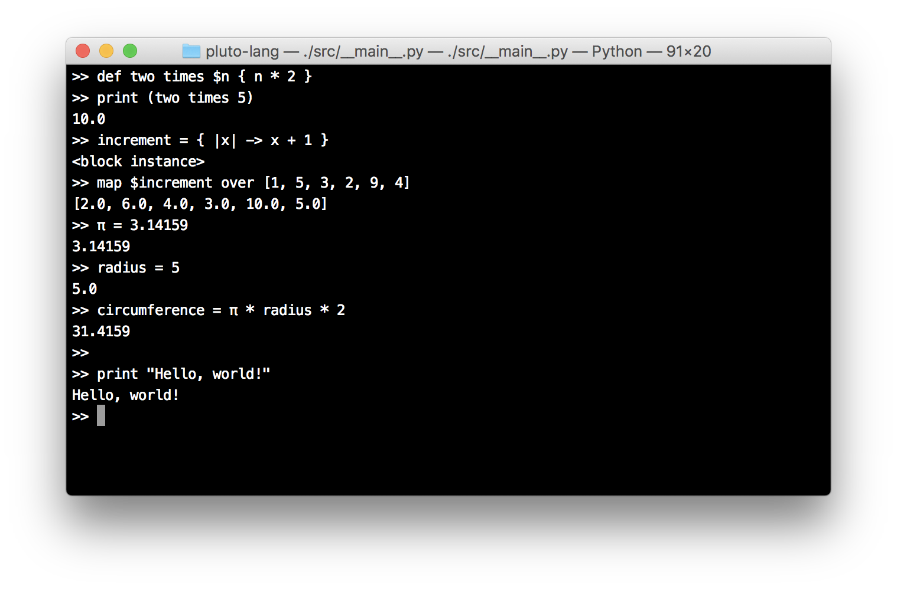

# Pattern Based Language



### What?

It's a proof-of-concept  language with a cool function definition/call syntax. Basically, instead of functions
being called with their arguments in parentheses after the name, they are represented by their patterns:

```
def this is a pattern {
  ...
};

\this is a pattern;
```

This snippet defines a function with a pattern of "this is a pattern". Then, whenever a function call (`\`) is
found, it searches through all the patterns which have been defined and calls the matching one. Coincidentally
this happens on the next line. It matches the pattern and calls whatever's inside the body.

Functions can, of course, also take parameters:

```
def evaluate $number times $multiplier {
  number * multiplier;
};

\evaluate (5) times (10);
```

This program results in  the value `50`. Hopefully, you can see why. In  a pattern in a function  definition,
when you have a dollar sign before an identifier it means that  it's a parameter. Then, when you call it, you
place an expression inside brackets at that position. Note that, inside the  function body, you don't use the
dollar signs before the variable names. The brackets are required  to resolve any ambiguity.

Another thing -  the pattern in the above examples are  really very  verbose, so it's  probably a bad idea to
make a pattern that long, as it would take longer to type out. For vague guidelines, you might want to have a
look at the **very** tiny standard library (the four functions inside `builtin_fns.py`). A couple of them are
quite long, but they're probably less used than the others so  the longer length doesn't matter, and improves
readability significantly.

### How??

To use it, clone the repository and run `__main__.py`. If you  don't give in any  cmd-line arguments, it will
open up a REPL. If you give it one  argument, that should be a file name relative  to the program, which will
be run.

### Contributions

Any contributions are welcome. Just send a pull request. I'll probably accept it if it adds anything useful.